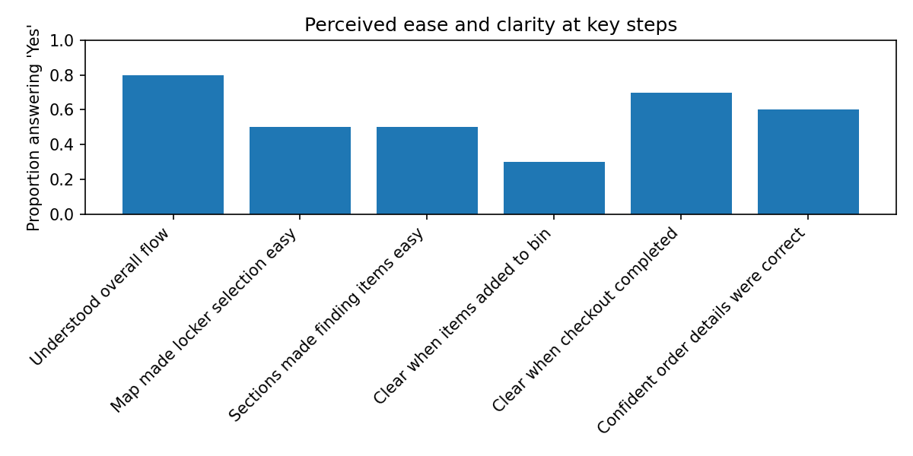
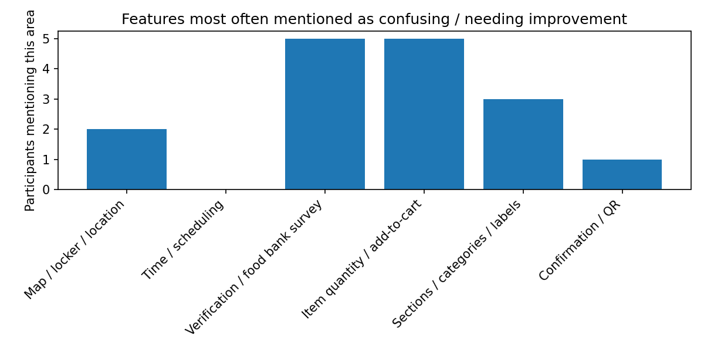

# Campus Food Security App — HCI Design & Usability Study

A mobile app concept that helps UBC students get food conveniently **and** lets
students facing financial constraints obtain food-bank items at no cost — without
social stigma. This repository covers the full HCI process: problem framing,
prototype design, a **task-based usability study with 10 participants**, and a
Python data analysis that turned messy survey responses into prioritized design fixes.

🔗 **Interactive prototype (Figma):** [Food Bank App Prototype](https://www.figma.com/design/iEuqR15GXceiWvJpPXt5ky/Food-Bank-App-Prototype?node-id=32-482&t=qNqKaoWZ6d0Gfawg-1)
📓 **Analysis notebook (renders in browser):** [`docs/Final report data analysis.ipynb`](docs/Final%20report%20data%20analysis.ipynb)
📑 **Demo slides:** [`docs/demo_slides.pdf`](docs/demo_slides.pdf)

---

## My role

I **led all of the data analysis** for this team project. I designed the analysis
approach, wrote the Python (pandas) to clean and code the usability-test data,
quantified how clear each step of the app felt to users, and synthesized the
open-ended feedback into friction themes that drove our design recommendations.
*(Design and prototyping were a team effort.)*

---

## The product

A grocery app **with a twist**, built on a campus vending-locker model:

- **Regular users** shop normally: add to cart → pay (e.g., Apple Pay) → receive a
  locker QR code to pick up at a UBC hub.
- **Verified food-insecure students** follow the same flow, but the app **bypasses
  the payment gateway** (total becomes \$0) so they can obtain food-bank items for
  free, discreetly and on their own schedule.

Design goals: **inclusivity** (no social stigma), **efficiency** (fast item finding),
and a clean, low-distraction interface with consistent styling for intuitive wayfinding.

---

## The usability study

| | |
|---|---|
| **Participants** | 10 |
| **Method** | Task-based usability test + structured/open-ended survey |
| **Tasks** | Place a regular order; place a food-bank order |
| **Data** | `participant_id`, `question_text`, `answer_text` — including messy free-text |
| **Approach** | Mixed methods: quantitative clarity metrics + qualitative friction coding |

---

## What the analysis does

**1 · Cleaning messy rating data.** Participants wrote ratings every which way
(`"8 out of 10"`, `"4/5"`, `"4,.5"`, `"4.5 --- 0.5 for..."`). A regex-based parser
normalises them all to a 0–10 scale.

**2 · Perceived ease & clarity at key steps.** For six task steps, the script
computes the share of participants who explicitly said "Yes."

| Step | Found it clear / easy (n = 10) |
|---|---|
| Understood overall flow | **80%** |
| Clear when checkout completed | 70% |
| Confident order details were correct | 60% |
| Map made locker selection easy | 50% |
| Sections made finding items easy | 50% |
| **Clear when items added to bin** | **30%** ⬅ weakest step |



**3 · Friction analysis.** Open-ended responses are coded into themes by keyword
and counted across participants.

| Friction area | Participants mentioning (n = 10) |
|---|---|
| Verification / food-bank survey | **5** |
| Item quantity / add-to-cart | **5** |
| Sections / categories / labels | 3 |
| Map / locker / location | 2 |
| Confirmation / QR | 1 |
| Time / scheduling | 0 |



---

## Key findings → design recommendations

| Finding | Recommendation |
|---|---|
| Only **30%** clear when item was added; 5/10 flagged add-to-cart friction | Add visual confirmation (count badge, toast, or animation) on add |
| **5/10** found food-bank verification confusing | Reduce steps; simplify copy so eligible students aren't deterred |
| **3/10** found category labels unclear or wordy | Tighten category names; clearer icons |
| **80%** understood the overall flow; **70%** clear on checkout | Core flow is solid — fixes are targeted, not structural |

---

## Repository structure

```
.
├── README.md
├── requirements.txt
├── usability_analysis.py               # cleaning · clarity · friction analysis
├── data/
│   └── usability_all_data.csv          # raw survey responses
├── docs/
│   ├── Final report data analysis.ipynb   # full analysis notebook (renders on GitHub)
│   ├── Final report data analysis.pdf     # exported notebook
│   ├── demo_slides.pdf                    # project demo deck
│   └── final_report.pdf
└── figures/
    ├── clarity_by_step.png             # generated by the script
    └── friction_areas.png              # generated by the script
```

## How to run

```bash
pip install -r requirements.txt
python usability_analysis.py
# → prints summary stats and writes figures to ./figures/
```

---

## Tech & skills

`Python` · `pandas` · `NumPy` · `matplotlib` · `regex` ·
usability testing · mixed-methods analysis · qualitative coding · data-driven design

---

*UBC CPSC 344 — Introduction to Human Computer Interaction Methods*
